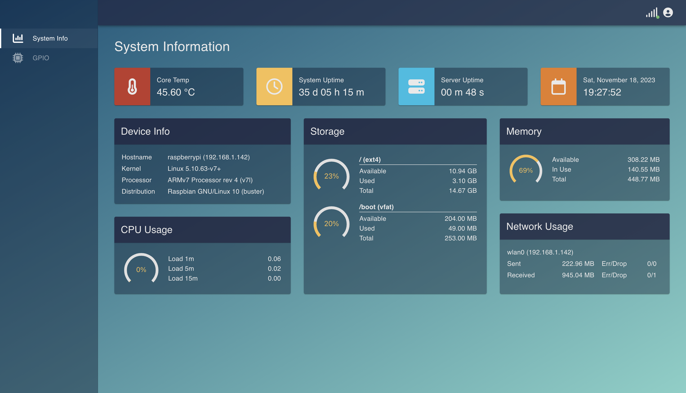

# Raspberry Pi Web App

This is the client component single-page application written in [React](https://react.dev/) and served by a [Node.js](http://nodejs.org/) server hosted on a Raspberry Pi. This web application needs the server component in order to function properly. 

The respository and setup instruction for the server can be found [here](https://github.com/Kadinata/raspi_web_server)

  <i>System Information Page</i>

## Installation & Setup

1. Install and setup the server component on the Raspberry Pi. (Instruction [here](https://github.com/Kadinata/raspi_web_server))
2. Clone this repository, run `npm install` to install the dependencies.
3. Create a production build with `npm run build`.
4. Deploy the app into the `public` directory on the server.

Start the server and the application can be viewed at [raspberrypi.local:3000](http://raspberrypi.local:3000/)

## Page Information

### System Information Page

* Located at `/systems`. This page displays system information (i.e. uptime, core temperature, as well as CPU, memory, network, and storage usage information), which are periodically updated in real time.
* This page is auth protected. The user must be logged in to view it.

### GPIO Information Page

* Located at `/gpio`. This page allows the user to view and control the state of the GPIO pins on the Raspberry Pi. Changes made to the state of one or more GPIO pins (e.g. by pressing a button) are displayed in real time on this page.
* This page is auth protected. The user must be logged in to view it.

### Login and Registration Page

* The login page is self-explanatory and is located at `/login`
* The register page (`/register`) creates a new user account needed to view the system information and gpio status pages.
